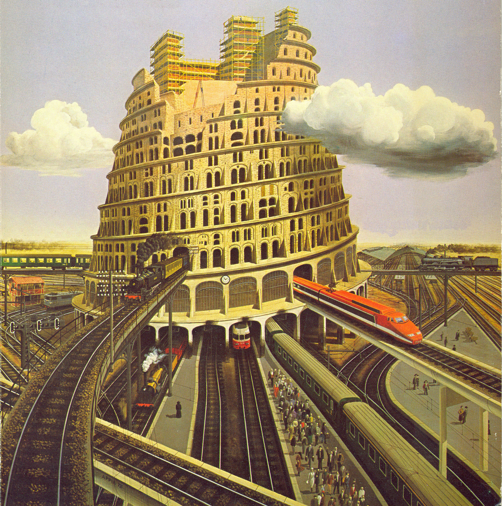
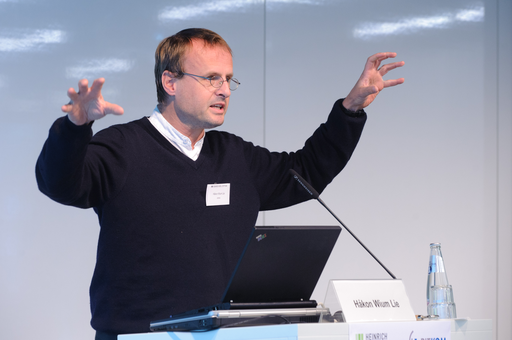
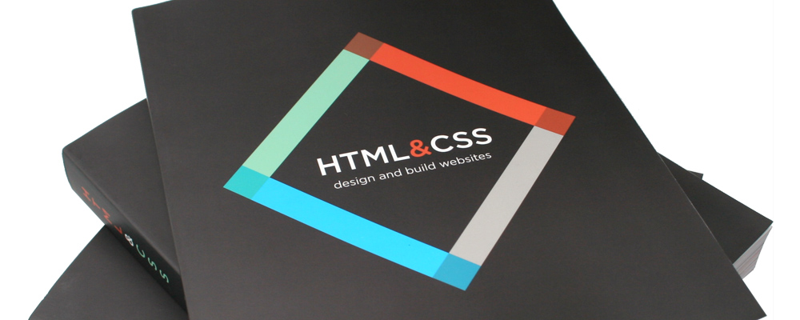

# CMD Internetstandaarden '14
> Belofte: Eind van dit blok hebben jullie allemaal een eigen website op internet

!

# Agenda

- Wat zijn internetstandaarden?
- Weekoverzicht op hoofdlijnen
- Werkwijze en verwachtingen
- Toetsing en beoordeling
- Berekening van de studielast
- Vragen?

!

# Standaardisatie

Om elkaar te verstaan moet je dezelfde taal spreken

Je hoeft dit niet voor te lezen.. maar dit is het verhaal van Babel. Deze wordt verborgen in de presentatie

<h3>Genesis 11, 1-9: Babel</h3>

1 Ooit werd er op de hele aarde één enkele taal gesproken. 2 Toen de mensen in oostelijke richting trokken, kwamen ze in Sinear bij een vlakte, en daar vestigden ze zich. 3 Ze zeiden tegen elkaar: ‘Laten we van klei blokken vormen en die goed bakken in het vuur.’ De kleiblokken gebruikten ze als stenen, en aardpek als specie. 4 Ze zeiden: ‘Laten we een stad bouwen met een toren die tot in de hemel reikt. Dat zal ons beroemd maken, en dan zullen we niet over de hele aarde verspreid raken.’ 5 Maar toen daalde de HEER af om te kijken naar de stad en de toren die de mensen aan het bouwen waren. 6 Dit is één volk en ze spreken allemaal een en dezelfde taal, dacht de HEER, en wat ze nu doen is nog maar het begin. Alles wat ze verder nog van plan zijn, ligt nu binnen hun bereik. 7 Laten wij naar hen toe gaan en spraakverwarring onder hen teweegbrengen, zodat ze elkaar niet meer verstaan. 8 De HEER verspreidde hen van daar over de hele aarde, en de bouw van de stad werd gestaakt. 9 Zo komt het dat die stad Babel heet, want daar bracht de HEER verwarring in de taal die op de hele aarde gesproken werd, en van daar verspreidde hij de mensen over de hele aarde.

<cite>Uit: De Nieuwe Bijbelvertaling &copy; 2004/2007 Nederlands Bijbelgenootschap</cite>

Daarna kan je deze aanhalen

<h3>Normaalspoor</h3>
<h3>Een stuk normaalspoor.</h3>

Met normaalspoor bedoelt men spoor- en tramwegen met een spoorwijdte van 1435 millimeter of oorspronkelijk 4 Engelse voet en 8½ Engelse duim. Dit is in de meeste Europese landen de meest voorkomende spoorwijdte. Deze spoorwijdte gaat terug tot houten sporen die in de Engelse mijnbouw werden gebruikt om de wagens te geleiden. George Stephenson gebruikte dezelfde spoorwijdte toen hij in 1825 de Stockton en Darlington spoorlijn opende. Sindsdien is deze spoorwijdte uitgegroeid tot een soort standaard voor spoorwegen, eerst in Engeland, later ook elders in Europa, waar eerst nog verschillende maten breedspoor zijn gebruikt. In enkele landen, waaronder in Spanje, Portugal en de voormalige Sovjet-Unie wordt nog steeds breedspoor gebruikt.

<h3>Normaalspoor in Nederland en België[bewerken]</h3>

In Nederland bestaan (afgezien van museumlijnen) alleen nog maar normaalsporige spoor-, metro- en tramlijnen. In België bestaan naast normaalsporige ook smalsporige tramlijnen (op meterspoor).

!

# Standaardisatie

Stemherkenning wordt steeds beter maar het verwerken van natuurlijke tekst blijft voor computers erg lastig

	
Een beeld uit Her met Joaquin Phoenix, de film speelt in het jaar 2025, en gaat over een man die een relatie begint met een intelligent besturingssysteem met een vrouwenstem en -persoonlijkheid.

	
In deze materie zit jij waarschijnlijk beter dan ik.. NLP is wel erg ver maar kost erg veel processorkracht, het is daarom handig als we de computer helpen en aangeven wat bepaalde stukken tekst voor waarde hebben, wat het type is...

!

# Standaardisatie op het web

Tim Berners Lee bedacht _HyperText Markup Language_ als standaard voor het uitwisselen van informatie op internet

!

# Standaardisatie op het web

Hakon Wium Lie bedacht CSS om die HTML van Tim een beetje toonbaar te maken

!

# Internet Standaarden

_Duckett, John, HTML & CSS: Design and build websites, John Wiley & Sons Inc, 2011_

Nederlandse of Engelse versie, papier of digitaal

!

# Weekoverzicht

<table class="vakoverzicht">
  <tr>
    <th>Week</th>
    <th>College</th>
    <th>Werkgroep</th>
    <th>Studielab</th>
  </tr>
  <tr>
    <td>37</td>
    <td>Introductie, werkwijze, overzicht en toetsing van het vak</td>
    <td>Installatie tools en eerste kennismaking met de materie</td>
    <td>dinsdag 10.10-13.00 medialounge</td>
  </tr>
  <tr>
    <td>38</td>
    <td>Historie van het internet, semantische HTML en client-server architectuur</td>
    <td>Criteria voor een goede website, beoordelingsformulier</td>
    <td>dinsdag 10.10-13.00 medialounge</td>
  </tr>
  <tr>
    <td>39</td>
    <td>The internet is made of hypertext, semantiek vs. syntaxis</td>
    <td>Omgaan met aangeleverde content, teksten in HTML zetten</td>
    <td>dinsdag 10.10-13.00 medialounge</td>
  </tr>
  <tr>
    <td>40</td>
    <td>Add some style, over de principes van css: kleur &amp; typografie</td>
    <td><strong>Aanwezigheid verplicht!</strong> Feedbacksessie HTML, een demo van de mogelijkheden van CSS</td>
    <td>dinsdag 10.10-13.00 medialounge</td>
  </tr>
  <tr>
    <td>41</td>
    <td>Layout met CSS, het box-model en menustructuren</td>
    <td>Layout voor eindopdracht schetsen met wireframes en deze proberen werkend te maken</td>
    <td>dinsdag 10.10-13.00 medialounge</td>
  </tr>
  <tr class="empty">
    <td>42</td>
    <td colspan="3">Herfstreces</td>
  </tr>
  <tr>
    <td>43</td>
    <td>Over het gebruik van afbeeldingen tabellen en formulieren. Javascript FTW!</td>
    <td>Werken aan eindopdracht</td>
    <td>dinsdag 10.10-13.00 medialounge</td>
  </tr>
  <tr>
    <td>44</td>
    <td>Responsie en tentamenvoorbereiding</td>
    <td><strong>Aanwezigheid verplicht!</strong> Feedbacksessie CSS</td>
    <td>dinsdag 10.10-13.00 medialounge</td>
  </tr>
  <tr>
    <td>45</td>
    <td><strong>Tentamen op 5 november!</strong></td>
    <td><strong>Eindopdracht indienen!</strong> 2 november 23.59u via Moodle</td>
  </tr>
</table>

!

# Werkwijze

Je zult bij de tijdsbesteding aan dit vak veel tijd achter je laptop doorbrengen (maar dat had je misschien al verwacht).

!

# Hoorcolleges
plaats voor 90 man! op inschrijving via Moodle
live stream, filmpje

!

# Werkgroepen

!

# Studielab
dinsdag van 10.10 - 13.00

!

# Toetsing en beoordeling

!

# Berekening van de studielast

!

# Vragen?