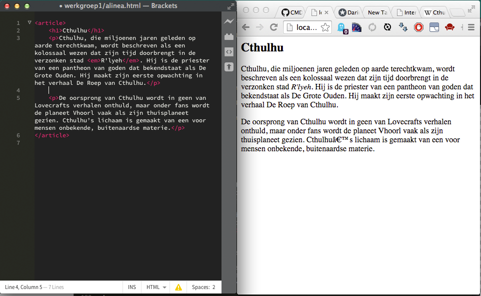
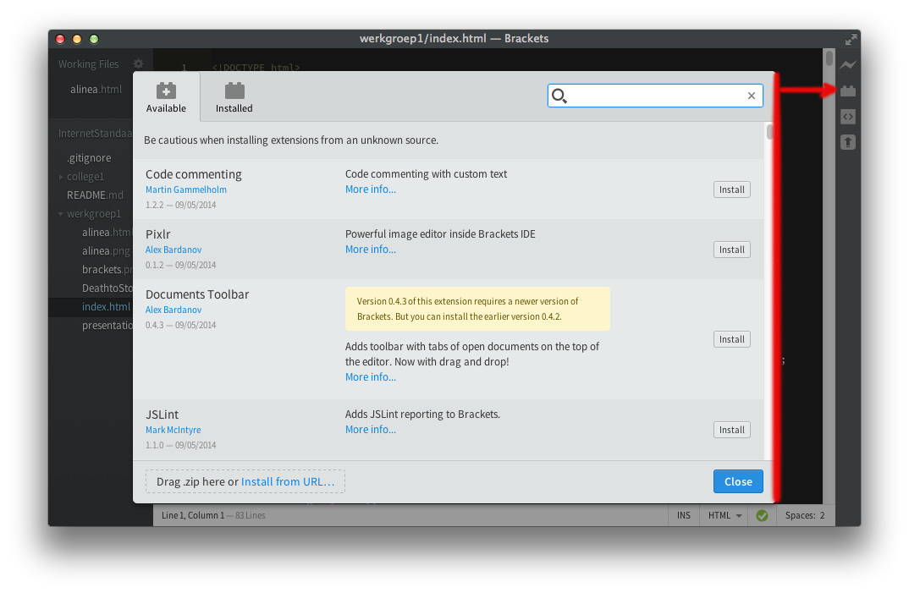
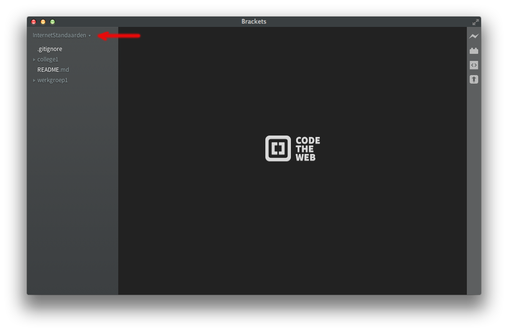
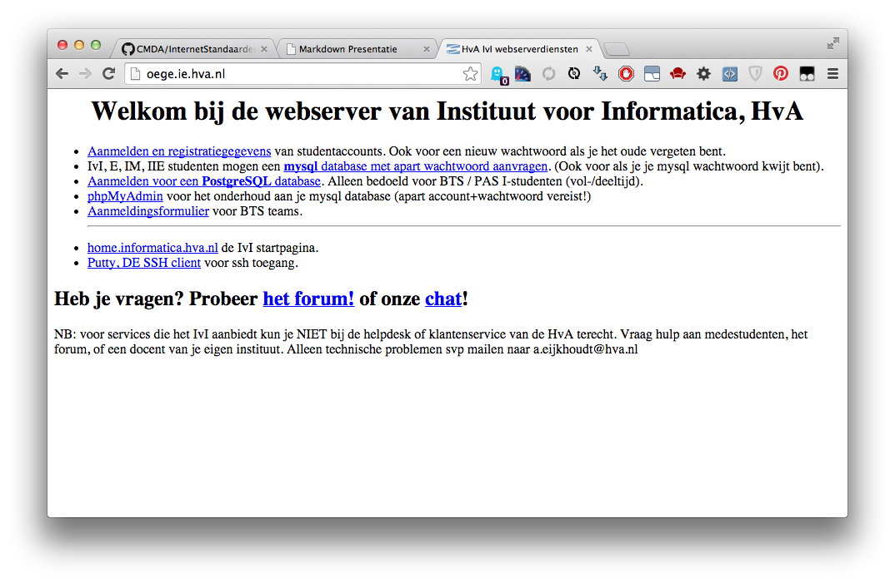
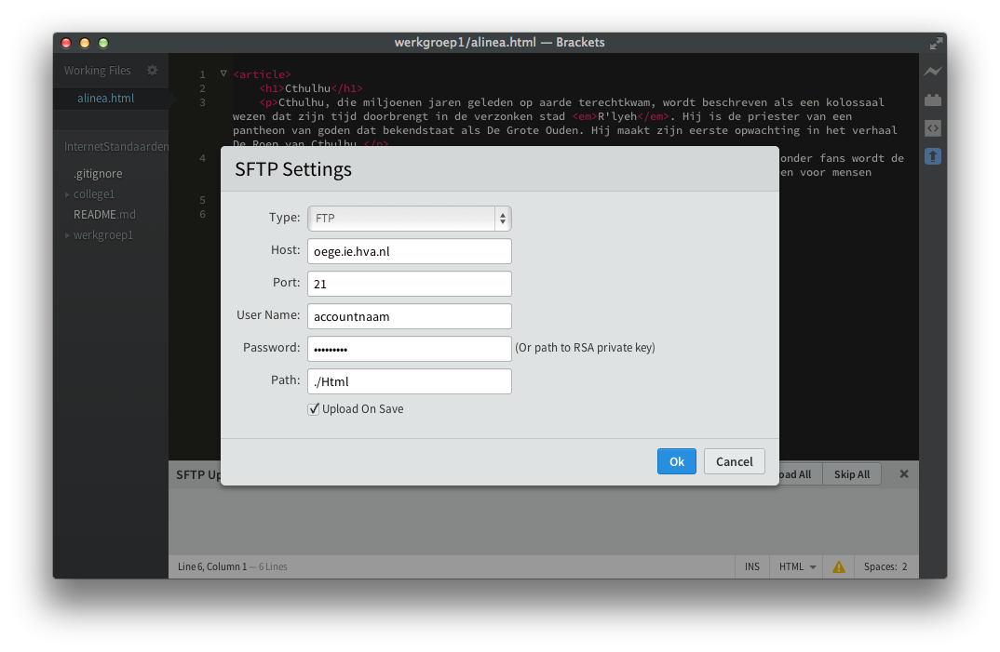
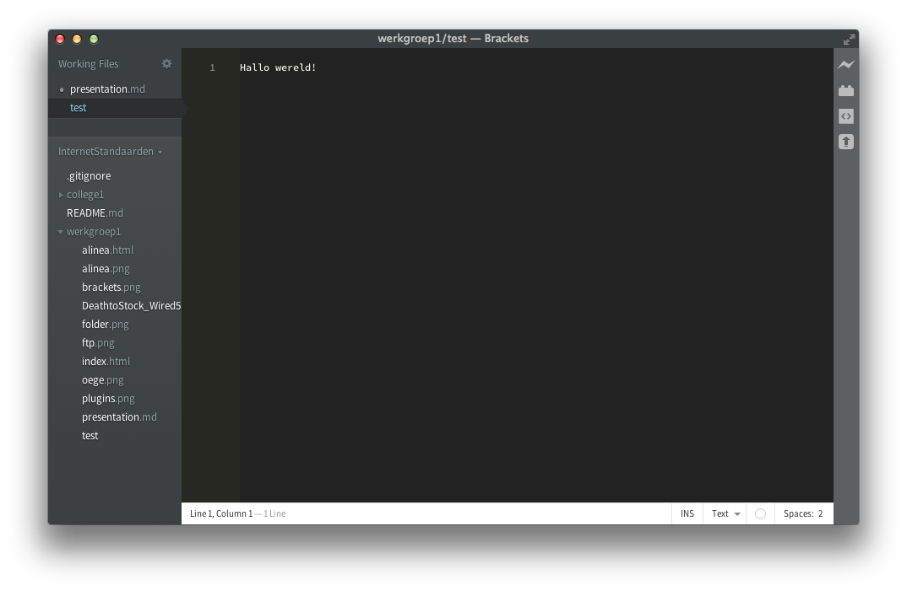

# Internetstandaarden
## Werkgroep 1 (week 37)


> Experts are built through excessive practice, so what are you waiting for…

!

# Agenda

- Praktische informatie over internet standaarden
- Conceptuele benadering HTML
- Installatie van Brackets.io (download alvast)
- Hallo wereld!
- Huiswerk

!

# Weekoverzicht

<table class="vakoverzicht">
  <tr>
    <th>Week</th>
    <th>College</th>
    <th>Werkgroep</th>
    <th>Practicum</th>
  </tr>
  <tr>
    <td>37</td>
    <td>Introductie, werkwijze, overzicht en toetsing van het vak</td>
    <td>Installatie tools en eerste kennismaking met de materie</td>
    <td class="empty" rowspan="2"></td>
  </tr>
  <tr>
    <td>38</td>
    <td>Historie van het internet, semantische HTML en client-server architectuur</td>
    <td>Criteria voor een goede website, beoordelingsformulier</td>
  </tr>
  <tr>
    <td>39</td>
    <td>The internet is made of hypertext, semantiek vs. syntaxis</td>
    <td>Omgaan met aangeleverde content, teksten in HTML zetten</td>
    <td>dinsdagochtend in de medialounge</td>
  </tr>
  <tr>
    <td>40</td>
    <td>Add some style, over de principes van css: kleur &amp; typografie</td>
    <td><strong>Aanwezigheid verplicht!</strong> Feedbacksessie HTML, een demo van de mogelijkheden van CSS</td>
    <td>idem</td>
  </tr>
  <tr>
    <td>41</td>
    <td>Layout met CSS, het box-model en menustructuren</td>
    <td>Layout voor eindopdracht schetsen met wireframes en deze proberen werkend te maken</td>
    <td>idem</td>
  </tr>
  <tr class="empty">
    <td>42</td>
    <td colspan="3">Herfstreces</td>
  </tr>
  <tr>
    <td>43</td>
    <td>Over het gebruik van afbeeldingen tabellen en formulieren. Javascript FTW!</td>
    <td>Werken aan eindopdracht</td>
    <td>idem</td>
  </tr>
  <tr>
    <td>44</td>
    <td>Responsie en tentamenvoorbereiding</td>
    <td><strong>Aanwezigheid verplicht!</strong> Feedbacksessie CSS</td>
    <td>idem</td>
  </tr>
  <tr>
    <td>45</td>
    <td><strong>Tentamen op 5 november!</strong></td>
    <td><strong>Eindopdracht indienen!</strong><br/>2 november 23.59u via Moodle</td>
  </tr>
</table>

!

# Toetsing
- Tentamen op woensdag 5 november @ IWO Zalen

_Stof: opgegeven hoofdstukken uit het boek en de colleges<br/>
Eenzijdig, handbeschreven A4 met aantekeningen!_

- Practicumopdracht op te leveren in week 44 (27 okt. - 2 nov.)

_Beoordelingssystematiek behandelen we volgende week_

**Let op:** Beide onderdelen moeten met een voldoende afgerond worden, een voldoende wordt bij CMD als volgt berekend (nerd alert):

    x >= 5,5

Om twee voorbeelden te geven (situatie a en b)

    a. voor x is 5,49999 is het antwoord: false

    b. voor x is 6,7 is het antwoord: true

Als beide onderdelen voldoende zijn worden deze gemiddeld, de uiteindelijke score wordt afgerond op een decimaal.

!


# Wat is een titel?


a.  Enkele dikgedrukte woorden boven de inhoud van een stuk tekst

b.  Enkele woorden waarmee de inhoud van een stuk tekst aangeduid wordt

c.  Hangt er van af hoe je het bekijkt

!

# Conceptuele benadering HTML
```HTML
<article>
    <h1>Cthulhu</h1>
    <p>Cthulhu ... <em>R'lyeh</em> ...</p>
    <p>De oorsprong ... materie.</p>
</article>
```
Bekijk het voorbeeld in HTML en behandel de volgende punten:

- Wat betekenen bovenstaande tekens die om de tekst heen staan
- Waarom zou dit op deze manier opgemaakt worden
- Kan je een alternatieve manier bedenken

!


Download Brackets en installeer deze, start na de installatie de editor

!



Klik op het lego-steen icoon aan de rechterkant en installeer de volgende vijf extensions door de naam in te typen in het zoeken vak: CSSLint, Emmet, SFtpUpload, W3CValidation en Whitespace Normalizer

!



Maak een map aan op een nuttige plaats waar al jouw internetstandaarden experimenten in komen te staan. Kies vervolgens in Brackets deze map als werkmap uit (bij het rode pijltje).

!



Ga naar oege.ie.hva.nl (vernoemd naar Oege de Jong) en maak een studentenaccount aan door op de bovenste link te klikken. Je kunt inloggen met je HvA (LDAP) account (waarmee je op email inlogt).

<strong>LET OP: voor oege krijg je een apart wachtwoord!</strong>

!



Keer terug naar Brackets en klik op het onderste icoon aan de rechterkant (met het pijltje) en klik op de knop met het opschrift 'Server Setup'. Voer de volgende gegevens in:

Type: FTP (dit staat voor File Transfer Protocol)<br/>
Host: oege.ie.hva.nl<br/>
Port: 21<br/>
User Name: jouw HvA account<br/>
Password: jouw oege wachtwoord (in je HvA mail!)<br/>
Path: ./Html<br/>
Upload On Save: aanvinken

!


# Hallo wereld (1)


1. Maak een nieuw bestand door CMD/CTRL+N te typen
2. Type iets in, bijvoorbeeld: Hallo Wereld!
3. Sla het op, kies een nuttige bestandsnaam
3. Open in je browser de URL: http://oege.ie.hva.nl

!

# Hallo wereld (2)

1. type weer iets in in bracket
2. sla dit op met de extentie .html
3. upload dat
4. bekijk dit in de browser

! 

# Hallo wereld (3)

1. neem de volgende structuur over (p26)
2. sla het bestand op met de extentie .html
3. type ‘Hallo wereld!’ tussen de <body> en </body> in
4. upload dat
5. bekijk dit in de browser

!


[opschrift](http://www.link.com "beschrijving")
