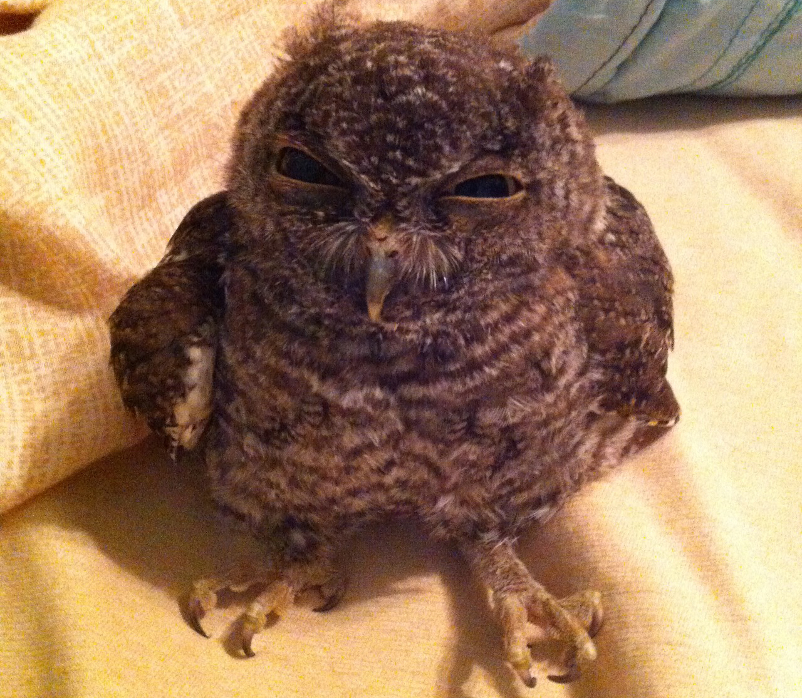
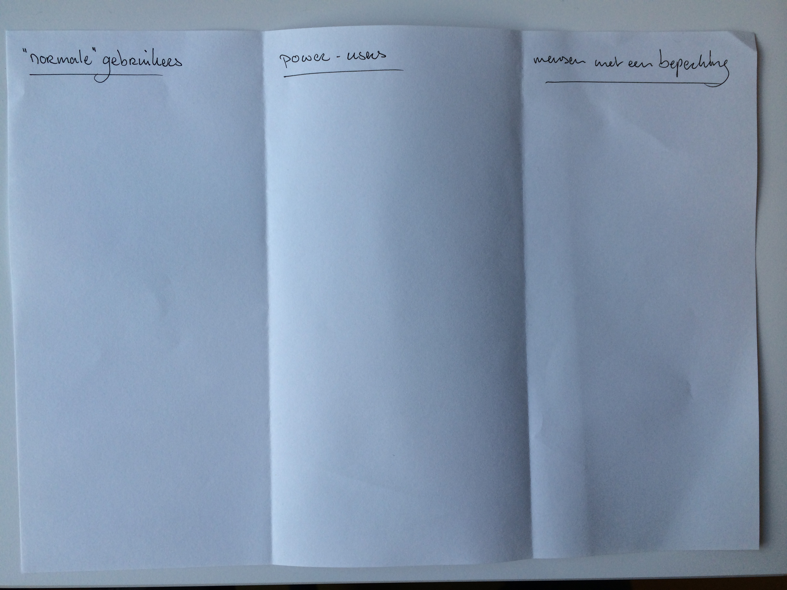

# CMD Internetstandaarden '14
>Ga zitten in groepen met mensen die hetzelfde artikel hebben opgemaakt

!

# Zijn er vragen?

- over de opzet van het vak
- over het leeswerk uit het boek
- over het huiswerk op codecademy.com

!

# Weekoverzicht

<table class="vakoverzicht">
  <tr>
    <th>Week</th>
    <th>College</th>
    <th>Werkgroep</th>
    <th>Studielab</th>
  </tr>
  <tr class="done">
    <td>37</td>
    <td>Introductie, werkwijze, overzicht en toetsing van het vak</td>
    <td>Installatie tools en eerste kennismaking met de materie</td>
    <td>dinsdag 10.10-13.00 medialounge</td>
  </tr>
  <tr>
    <td>38</td>
    <td>Historie van het internet, semantische HTML en client-server architectuur</td>
    <td>Criteria voor een goede website, beoordelingsformulier</td>
    <td>dinsdag 10.10-13.00 medialounge</td>
  </tr>
  <tr>
    <td>39</td>
    <td>The internet is made of hypertext, semantiek vs. syntaxis</td>
    <td>Omgaan met aangeleverde content, teksten in HTML zetten</td>
    <td>dinsdag 10.10-13.00 medialounge</td>
  </tr>
  <tr>
    <td>40</td>
    <td>Add some style, over de principes van css: kleur &amp; typografie</td>
    <td><strong>Aanwezigheid verplicht!</strong> Feedbacksessie HTML, een demo van de mogelijkheden van CSS</td>
    <td>dinsdag 10.10-13.00 medialounge</td>
  </tr>
  <tr>
    <td>41</td>
    <td>Layout met CSS, het box-model en menustructuren</td>
    <td>Layout voor eindopdracht schetsen met wireframes en deze proberen werkend te maken</td>
    <td>dinsdag 10.10-13.00 medialounge</td>
  </tr>
  <tr class="empty">
    <td>42</td>
    <td colspan="3">Herfstreces</td>
  </tr>
  <tr>
    <td>43</td>
    <td>Over het gebruik van afbeeldingen tabellen en formulieren. Javascript FTW!</td>
    <td>Werken aan eindopdracht</td>
    <td>dinsdag 10.10-13.00 medialounge</td>
  </tr>
  <tr>
    <td>44</td>
    <td>Responsie en tentamenvoorbereiding</td>
    <td><strong>Aanwezigheid verplicht!</strong> Feedbacksessie CSS</td>
    <td>dinsdag 10.10-13.00 medialounge</td>
  </tr>
  <tr>
    <td>45</td>
    <td><strong>Tentamen op 5 november!</strong></td>
    <td><strong>Eindopdracht indienen!</strong> 2 november 23.59u via Moodle</td>
  </tr>
</table>

!

# Huiswerkbespreking

Cthulhu Cthulhu (alternatieve spellingen: Tulu, Cthulu, Ktulu, en veel andere) is een fictieve, monsterlijke godheid in de Cthulhu Mythos van H.P. Lovecraft. Cthulhu krijgt in het Engels soms de titel Great (Groot) of Dread (Afschrikwekkend) Achtergrond Cthulhu, die miljoenen jaren geleden op aarde terechtkwam, wordt beschreven als een kolossaal wezen dat zijn tijd doorbrengt in de verzonken stad R'lyeh. Hij is de priester van een pantheon van goden dat bekendstaat als De Grote Ouden. Hij maakt zijn eerste opwachting in het verhaal De Roep van Cthulhu. De oorsprong van Cthulhu wordt in geen van Lovecrafts verhalen onthuld, maar onder fans wordt de planeet Vhoorl vaak als zijn thuisplaneet gezien. Cthulhu's lichaam is gemaakt van een voor mensen onbekende, buitenaardse materie. Cthulhu wordt in Lovecrafts verhalen verder omschreven als een wezen waarvan het exacte uiterlijk niet in woorden te omvatten is. Wel vermeldt de omschrijving dat hij een groene huid en klauwen heeft, en mogelijk zo groot als een berg is. Sommige mensen op aarde zijn op de hoogte van Cthulhu's bestaan, en vereren hem via sekten. Onder andere bij de Inuit en de Arabieren bevinden zich zulke sekten, al kennen zij Cthulhu elk onder een andere naam. Mythos De verhalencyclus die geschreven werd door Lovecraft, zijn protegés en zijn literaire opvolgers dragen het label Cthulhu Mythos, een term die is uitgevonden door August Derleth maar niet door Lovecraft werd gebruikt. Het personage Cthulhu is echter een van de minder verschrikkelijke schepsels in het pantheon. Cthulhu zelf debuteerde in Lovecrafts kortverhaal "The Call of Cthulhu" (1928) hij verschijnt kort in enkele andere werken. Cthulhu in populaire cultuur Cthulhu wordt talloze keren vermeld door andere artiesten in de literatuur, muziek, televisie, film en computerspellen. Zo hebben meerdere artiesten een lied gemaakt over Cthulhu of de Mythos (bijvoorbeeld Metallica met "The Call of Ktulu" en deadmau5 met "Cthulhu Sleeps"). Cthulhu is oproepbaar in het spel Scribblenauts en speelt een rol in de afleveringen "Coon 2: Hindsight", "Mysterion Rises", en "Coon vs. Coon & Friends" van South Park.

!

# Huiswerkbespreking

- is het gelukt met het opmaken van je artikel?

Jullie controleren straks het huiswerk op de volgende drie punten:

- **Structuur**, is het netjes verzorgd of een rommeltje
- **Syntaxis**, is het opgemaakt volgens de regels van het W3C (icoon onderin)
- **Semantiek**, zijn de juiste elementen voor de verschillende onderdelen gekozen

!

# Huiswerkbespreking
Voorbeeld van nette code

	<!DOCTYPE html>
	<html>
	<head>
		<meta charset="utf-8" />
		<title>Een nette titel zeg</title>	
	</head>
	<body>
		<h1>Dit is de titel van een stuk</h1>
		
En hier volgt een alineatekst.

	</body>
	</html>

!

# Huiswerkbespreking
Voorbeeld van slordige code

	<!DOCTYPE html><html><head>
				<meta charset="utf-8" />
	<title>Een nette 

	titel zeg</title>	
			</head><body>
		<h1>Dit is de titel
					van een stuk</h1>
				
En hier volgt een alineatekst.

	</body></html>

!

# Huiswerkbespreking
Voorbeeld van een syntactische fout

	<!DOCTYPE html>
	<html>
	<head>
		<meta charset="utf-8" />
		<title>Een nette titel zeg</title>	
	</head>
	
		<h1>Dit is de titel van een stuk</h3>
		
En hier volgt een alineatekst.
	</body>
	</html>

!

# Huiswerkbespreking
Voorbeeld van een semantische fout

	<!DOCTYPE html>
	<html>
	<head>
		<meta charset="utf-8" />
		<title>Een nette titel zeg</title>	
	</head>
	<body>
		<strong>Dit is de titel van een stuk</strong>
		<blockquote>En hier volgt een alineatekst.</blockquote>
	</body>
	</html>

!

# Beoordeling practicum

!

# Wat maakt een website goed

!

# Recap

- drie soorten fouten in HTML: slordigheid, syntactisch en semantisch
- beoordelingssystematiek van het practicum
- wat maakt een website goed

!

# Huiswerk

- Op codecademy.com uit de HTML & CSS track: HTML Basics II en Social Networking Profile.
- Verzamel content voor je website (tenminste 4 pagina's)

In je website moeten minstens vier pagina’s komen. Bedenk welke pagina’s je website gaat
hebben. Schrijf de content of verzamel de content. LET OP: dat je je bron moet vermelden
als je de content niet zelf schrijft.

Maak een ‘over mij’ pagina waarin je kort vertelt over jezelf en eventueel contactgegevens
neerzet.

Maak HTML-pagina’s voor de content. Je hoeft nu nog niet na te denken over vormgeven,
alleen nog maar het structureren van je content.

Zet de website online op je Oege account.

- Optioneel: Ga verder met de HTML essential training op Lynda.com (via het Lynda Portal van de HvA)

