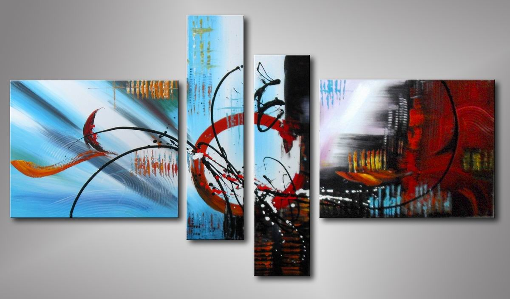

# CMD Internetstandaarden '14
> Any fool can write code that a computer can understand. Good programmers write code that humans can understand. - Martin Fowler

!

# Zijn er vragen?

- over het college
- over de opzet van het vak
- over het leeswerk uit het boek
- over het huiswerk op codecademy.com

!

# Weekoverzicht

<table class="vakoverzicht">
  <tr>
    <th>Week</th>
    <th>College</th>
    <th>Werkgroep</th>
    <th>Studielab</th>
  </tr>
  <tr class="done">
    <td>37</td>
    <td>Introductie, werkwijze, overzicht en toetsing van het vak</td>
    <td>Installatie tools en eerste kennismaking met de materie</td>
    <td>dinsdag 10.10-13.00 medialounge</td>
  </tr>
  <tr class="done">
    <td>38</td>
    <td>Historie van het internet, semantische HTML en client-server architectuur</td>
    <td>Criteria voor een goede website, beoordelingsformulier</td>
    <td>dinsdag 10.10-13.00 medialounge</td>
  </tr>
  <tr>
    <td>39</td>
    <td>The internet is made of hypertext, semantiek vs. syntaxis</td>
    <td>Omgaan met aangeleverde content, teksten in HTML zetten</td>
    <td>dinsdag 10.10-13.00 medialounge</td>
  </tr>
  <tr>
    <td>40</td>
    <td>Add some style, over de principes van css: kleur &amp; typografie</td>
    <td><strong>Aanwezigheid verplicht!</strong> Feedbacksessie HTML, een demo van de mogelijkheden van CSS</td>
    <td>dinsdag 10.10-13.00 medialounge</td>
  </tr>
  <tr>
    <td>41</td>
    <td>Layout met CSS, het box-model en menustructuren</td>
    <td>Layout voor eindopdracht schetsen met wireframes en deze proberen werkend te maken</td>
    <td>dinsdag 10.10-13.00 medialounge</td>
  </tr>
  <tr class="empty">
    <td>42</td>
    <td colspan="3">Herfstreces</td>
  </tr>
  <tr>
    <td>43</td>
    <td>Over het gebruik van afbeeldingen tabellen en formulieren. Javascript FTW!</td>
    <td>Werken aan eindopdracht</td>
    <td>dinsdag 10.10-13.00 medialounge</td>
  </tr>
  <tr>
    <td>44</td>
    <td>Responsie en tentamenvoorbereiding</td>
    <td><strong>Aanwezigheid verplicht!</strong> Feedbacksessie CSS</td>
    <td>dinsdag 10.10-13.00 medialounge</td>
  </tr>
  <tr>
    <td>45</td>
    <td><strong>Tentamen op 5 november!</strong></td>
    <td><strong>Eindopdracht indienen!</strong> 2 november 23.59u via Moodle</td>
  </tr>
</table>

!

# Oefening: Aanlevering content

Op Moodle vind je een .zip bestand welke je nodig hebt voor deze oefening.

1. Download het bestand
2. Pak het uit in de map voor internet standaarden
3. Open Intranet.html in jouw editor
4. Open het bestand ook in jouw browser
5. Voer de wijzigingen door, check na elke wijziging of het gelukt is.

!

# Nabespreking

!

# Nabespreking

Dit vak gaat over het voorkomen van dit soort frustratie door standaarden op dusdanige wijze te gebruiken dat:

- HTML broncode (source) leesbaar, overdraagbaar en gemakkelijk te onderhouden is
- Inhoud en vormgeving (en gedrag) van elkaar gescheiden zijn door in losse bestanden te werken

!

# Nabespreking

Als je in opdracht een website maakt *MOET* je afspraken maken over de aanlevering van content:

- Op welke manier (in welk bestandsformaat) worden teksten aangeleverd
- Op welke manier (in welk bestandsformaat) worden afbeeldingen aangeleverd
- Hoeveel keer mag de opdrachtgever binnen de marges van het project op- en aanmerkingen maken
- Hoe worden eventuele wijzigingen doorgegeven en wat voor afspraken zijn daarover (prijs per uur?)

!

# Huiswerkbespreking

Hebben jullie 4 pagina's bedacht en er teksten en/of afbeeldingen voor gezocht?

!

# Huiswerkbespreking

- Verzamel content voor je website (tenminste 4 pagina's)

In je website moeten minstens vier pagina’s komen. Bedenk welke pagina’s je website gaat
hebben. Schrijf de content of verzamel de content. LET OP: dat je je bron moet vermelden
als je de content niet zelf schrijft.

Maak een ‘over mij’ pagina waarin je kort vertelt over jezelf en eventueel contactgegevens
neerzet.

Maak HTML-pagina’s voor de content. Je hoeft nu nog niet na te denken over vormgeven,
alleen nog maar het structureren van je content.

Zet de website online op je Oege account.

!

# Zelfwerkzaamheid

Neem rustig de tijd om de eerste tekst netjes in HTML te zetten, het is handig om de volgende structuur te hanteren:

- Begin met het verdelen van de body in secties als: &lt;header>, &lt;nav>, &lt;main> en &lt;footer>. De zogenaamde _macro_ elementen.
- Maak daarna de als huiswerk gemaakte tekst op met elementen als: &lt;h1>, &lt;h2>, &lt;p>, &lt;blockquote>, &lt;ul>, &lt;img>. De zogenaamde _meso_ elementen.
- Voeg daarna waar nodig extra semantiek toe met elementen als: &lt;strong>, &lt;em>, &lt;quote>, &lt;cite> etc. de zogenaamde _micro_ elementen.
- Leg tenslotte de verbindingen met andere pagina's met &lt;a href="">

!

# Recap

- Aanpassingen maken aan een slecht opgezette webpagina sucks...
- Maak afspraken over aanlevering van content als je in opdracht werkt.
- Als je een pagina maakt kan je het beste systematisch, van _macro_ naar _meso_ naar _micro_ elementen werken.

!

# Huiswerk

- Op codecademy.com uit de HTML & CSS track: HTML Basics III en Clickable Photo Page
- Maak het HTML gedeelte van je eindopdracht af zodat je voldoet aan de volgende criteria:

AVV:

1. De website bestaat uit tenminste vier pagina's
2. De website bevat relevante inhoud in correct Nederlands
3. De website is verzorgd en leesbaar opgemaakt (ook de broncode!!)
4. Wanneer de content niet zelf is geproduceerd, wordt de bron vermeld
5. De website staat op de in de les aangegeven server en is zonder technische problemen te bereiken

Minimale Criteria

6. De HTML-code is semantisch correct, de inhoud is goed gestructureerd
7. De HTML-code is syntactisch correct, levert geen fouten op bij validatie
8. De website heeft een menu gebaseerd op unordered lists
9. De code voldoet aand e in de les aangereikte codingstandaarden

